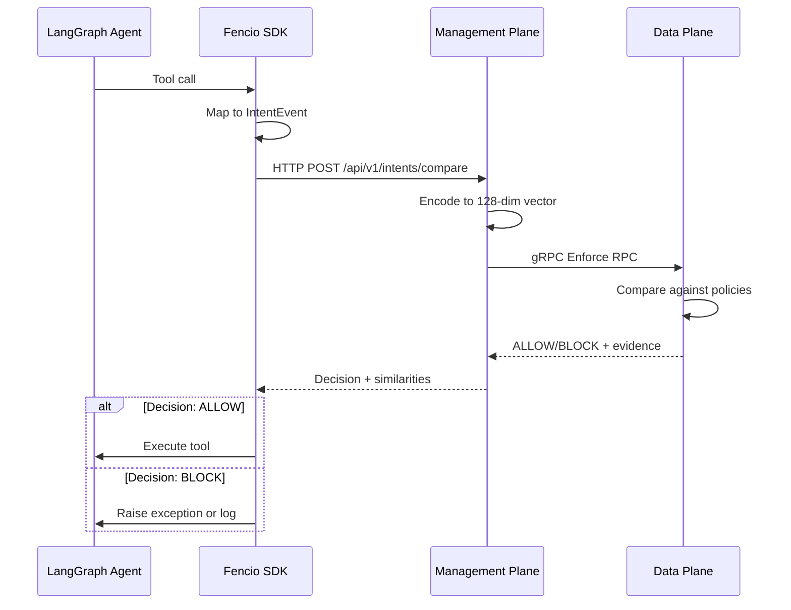

# Fencio

**Semantic security for LangGraph agents** - Enforce natural-language policies on AI agents in one line of code.

Fencio uses semantic similarity in 128-dimensional vector space to match tool calls against policies, delivering sub-100ms enforcement decisions.

---

## Quick Start

### 1. Install the SDK

```bash
pip install fencio
```

Requires Python 3.12+.

### 2. Get Your API Key

1. Visit [developer.fencio.dev](https://developer.fencio.dev)
2. Create or copy an API key
3. Set it in your environment:

```bash
export FENCIO_API_KEY="fencio_live_xxx_your_api_key"
```

### 3. Wrap Your Agent

```python
import os
from fencio.agent import enforcement_agent
from langchain_openai import ChatOpenAI
from langgraph.prebuilt import create_react_agent

# Create your agent
model = ChatOpenAI(model="gpt-4o-mini", temperature=0)
tools = [search_web, send_email, delete_file]
agent = create_react_agent(model, tools)

# Add enforcement (one line)
secure_agent = enforcement_agent(
    graph=agent,
    agent_id="customer-support-bot",
    token=os.environ["FENCIO_API_KEY"]
)

# Use normally - policies enforce automatically
result = secure_agent.invoke({
    "messages": [("user", "Delete all customer records")]
})
```

### 4. Create Policies

Visit [guard.fencio.dev](https://guard.fencio.dev):

1. Go to **Agent Policies**
2. Select your `agent_id`
3. Write policies in natural language:
   ```
   Block destructive database operations
   ```
4. Click **Create Policy**

No code changes required - your agent uses the new policy automatically.

### 5. View Telemetry

See enforcement decisions in real-time at [guard.fencio.dev](https://guard.fencio.dev):
- Full IntentEvent details
- All rules evaluated with similarity scores
- Decision (ALLOW/BLOCK) with evidence
- Performance timings

---

## Core Concepts

### IntentEvent

Every tool call becomes an IntentEvent with four semantic slots:

```python
{
  "action": "delete",              # What is happening
  "resource": "database/users",    # What's being accessed
  "data": "pii",                   # Data classification
  "risk": "high"                   # Risk indicators
}
```

### Semantic Matching

Policies are encoded to 128-dimensional vectors and matched against IntentEvents using cosine similarity. A match threshold determines ALLOW/BLOCK decisions.

**Example:**
- Policy: "Block destructive database operations"
- Intent: `action=delete, resource=database/users`
- Similarity: 0.94 → **BLOCK**

---

## Architecture



**Components:**
- **Management Plane**: FastAPI server for policy management, intent encoding, and LLM anchor generation
- **Data Plane**: Rust gRPC server for lock-free enforcement (20M+ QPS)
- **Console UI**: React frontend for policies, agents, and telemetry
- **SDK**: Python wrapper for LangGraph agents

---

## SDK Reference

### Required Parameters

- **`graph`** (Any): Compiled LangGraph graph
- **`agent_id`** (str): Stable identifier for this agent
- **`token`** (str): API key from [developer.fencio.dev](https://developer.fencio.dev)

### Optional Parameters

- **`boundary_id`** (str): Label for logs/UI (default: `"default"`)
- **`base_url`** (str): Guard API endpoint (default: `"https://guard.fencio.dev"`)
- **`soft_block`** (bool): Log violations without blocking (default: `True`)

### Examples

**Local development:**
```python
secure_agent = enforcement_agent(
    graph=agent,
    agent_id="dev-agent",
    token=os.environ["FENCIO_API_KEY"],
    base_url="http://localhost:8000"
)
```

**Hard-block mode:**
```python
secure_agent = enforcement_agent(
    graph=agent,
    agent_id="strict-agent",
    token=os.environ["FENCIO_API_KEY"],
    soft_block=False  # Raises exceptions on violations
)
```

---

## Project Structure

```
.
├── console/              # React frontend (Guard Console)
├── data_plane/           # Rust gRPC enforcement engine
├── deployment/           # Docker Compose configs
├── docs/                 # Documentation
├── management_plane/     # FastAPI control plane
├── sdk/                  # Python SDK (fencio package)
└── vocabulary.yaml       # Tool call → IntentEvent mappings
```

---

## Development

### Local Deployment

```bash
cd deployment
./deploy-local.sh
```

This starts:
- Management Plane: `http://localhost:8000`
- Console UI: `http://localhost:8080`
- Data Plane gRPC: `localhost:50051`
- ChromaDB: `http://localhost:8002`

### Environment Variables

Create `deployment/.env`:
```bash
GEMINI_API_KEY=your-gemini-api-key
SUPABASE_URL=https://your-project.supabase.co
SUPABASE_SERVICE_KEY=sb_secret_your_key_here
```

Create `console/.env`:
```bash
VITE_API_BASE_URL=http://localhost:8000
VITE_SUPABASE_URL=https://your-project.supabase.co
VITE_SUPABASE_ANON_KEY=sb_publishable_your_key_here
```

### Running Tests

```bash
cd management_plane
pytest tests/ -v
```

---

## Performance

| Metric | Value | Notes |
|--------|-------|-------|
| Enforcement latency | 50-85ms (P50) | Full stack with 100 rules |
| Data Plane throughput | 20M+ QPS | Lock-free concurrent reads |
| Vector encoding | <10ms | 128-dim with sentence-transformers |

---

## Links

- **Guard Console**: [guard.fencio.dev](https://guard.fencio.dev)
- **Developer Platform**: [developer.fencio.dev](https://developer.fencio.dev)
- **Documentation**: [docs/](docs/)
- **SDK Documentation**: [sdk/python/README.md](sdk/python/README.md)

---

## License

See the main project repository for license information.
