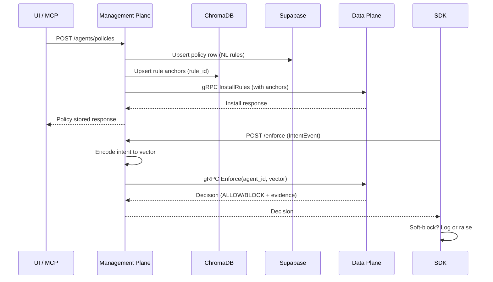

# Plan: Minimal Changes for Rule/Intent Embedding Pipeline
Created: 2025-11-23

## Goals
- Persist every UI/MCP policy rule in Supabase and store its encoded vector (anchors) in ChromaDB under the same rule_id.
- Encode intent events inside the Management Plane before forwarding embeddings to the Data Plane.
- Keep the Data Plane focused on vector comparison + decision only; it should no longer call encoding endpoints or touch Supabase/Chroma directly.
- Preserve existing soft-block semantics in the SDK (Management Plane returns decisions; SDK decides whether to enforce or just log).

## Current Flow (Key Pain Points)
1. Policy creation: Management Plane saves NL policy to Supabase, then RuleInstaller calls Data Plane `InstallRules`. During install the Data Plane calls back into Management Plane `/encode/rule/*` to build anchors on the fly. Anchors are not persisted anywhere else.
2. Intent enforcement: SDK’s `enforcement_agent` sends the raw IntentEvent (JSON) straight to the Data Plane gRPC. The Data Plane again calls Management Plane `/encode/intent` to embed the event before comparison.
3. Storage split: Supabase tracks policy metadata, but there is no shared persistent store (e.g., ChromaDB) for the embeddings. Data Plane holds rule vectors only in memory; restarts drop them.

This violates the desired flow where embeddings are generated/stored centrally and the Data Plane simply compares vectors it receives.

## Target Flow (Minimal Adjustments)
1. **Policy ingestion / rule storage**
   - After NL policy parsing, the Management Plane immediately encodes anchors via the existing `rule_encoding` helpers.
   - Persist those vectors to ChromaDB keyed by `rule_id` (same id as Supabase row). Include metadata (agent_id, template_id, tenant_id, thresholds) for quick lookup.
   - Update Supabase row with a flag or checksum so we know the Chroma entry is in sync.

2. **Rule installation**
   - Extend RuleInstaller to fetch the already-encoded vectors from ChromaDB and include them directly in the `InstallRulesRequest` (new repeated bytes field or reusing existing params block) so the Data Plane does not call `/encode/rule/*`.
   - Update the Data Plane gRPC server to accept pre-encoded anchors and skip its HTTP call; if anchors are provided it just loads them into the bridge.

3. **Intent enforcement path**
   - Add a lightweight Management Plane endpoint `/api/v1/enforce` (or reuse existing `compare` handler) that:
     1. Accepts the IntentEvent from the SDK.
     2. Encodes it with `encode_to_128d` locally.
     3. Calls the Data Plane `Enforce` RPC with the embedding (not the raw IntentEvent) and collects the ALLOW/BLOCK decision.
   - Update `SecureGraphProxy` to talk to the Management Plane endpoint instead of the Data Plane gRPC directly (Management Plane becomes the proxy). In hard-block mode it still raises `PermissionError`; in soft-block mode it logs as today.

4. **Data Plane scope reduction**
   - Remove the Data Plane’s dependency on Management Plane HTTP clients (`encoding_http_client`). It should expose only three RPCs the MP needs: `InstallRules`, `RemoveAgentRules`, `Enforce`.
   - `InstallRules` stores the provided anchor vectors in-memory; `Enforce` accepts `{agent_id, layer, intent_vector}` and runs comparisons.

5. **Operational glue**
   - Provide a small management job/CLI (`scripts/sync_rules.py`) to backfill existing rules: read Supabase policies, encode anchors, write to Chroma, push to Data Plane. This keeps prod and local envs consistent without manual DB edits.

## Implementation Steps (keep it simple)
1. **Management Plane – Rule Persistence**
   - Extend `rule_installer.policy_to_rule` pipeline:
     - After `build_rule_anchors`, write to Chroma using `chromadb` client with document id = `rule_id`.
     - Store anchor payload (list of vectors per slot) so we can retrieve them later.
   - Add small helper in `rule_installer` to fetch anchors from Chroma before sending to Data Plane.

2. **ChromaDB Schema**
   - Namespace per tenant (e.g., `rules_{tenant_id}`) or add metadata filter.
   - Each record: `{id: rule_id, metadata: {agent_id, template_id, thresholds}, embeddings: flattened 128*? }`.

3. **Data Plane Protobuf Update**
   - Modify `rule_installation.proto` `RuleInstance` to include optional `RuleAnchors` message (same structure as `/encode/rule` response). Regenerate stubs.
   - Update Rust bridge server to accept anchors directly; if missing, fall back to current HTTP encode (for backward compatibility during rollout).

4. **Management Plane – Intent Enforcement Endpoint**
   - Add `/api/v1/enforce` FastAPI handler:
     - Validate agent/boundary mapping (reuse `compare_intent` logic).
     - Encode intent: `encode_to_128d` returns list[float].
     - Call Data Plane `Enforce` RPC with `{agent_id, intent_vector, layer}`.
     - Return the `ComparisonResult` to the SDK.

5. **SDK Update**
   - Point `SecureGraphProxy` `enforcement_mode="management_plane"` by default and have the new client send requests to `/api/v1/enforce`.
   - Keep `enforcement_mode="data_plane"` as escape hatch until the new path stabilizes.

6. **Pipeline Validation**
   - Write an integration test: create policy via API, confirm Supabase row + Chroma entry exist, install rules, restart Data Plane (should reload from MP via reinstall job), run agent to ensure decisions still respect policy.

7. **Docs**
   - Update `STATUS.md` once implemented and add runbook for Chroma backfill + failure modes (e.g., Chroma down -> block policy install).

## Minimal Debug Strategy
- Instrument the Management Plane logs around Chroma writes/reads and Data Plane RPC payload sizes.
- Add `/api/v1/diagnostics/rules/{agent_id}` to dump what anchors the MP thinks exist vs what the Data Plane reports via `GetRuleStats`.
- Use soft-block during rollout so policies don’t stop agents if embeddings drift.

## Simple Implementation Plan (Atomic TODOs)
1. **Chroma client + config wiring**
   - [x] Add Chroma connection settings to `management-plane/app/config.py`.
   - [x] Implement a reusable Chroma helper module (create collection, upsert, fetch by rule_id).

2. **Rule persistence path**
   - [x] Update `rule_installer.py` to encode anchors once, persist to Chroma, and reuse cached anchors per rule.
   - [x] Store Chroma sync metadata (timestamp/hash) back into Supabase payload when policy is saved.

3. **Proto & data plane adjustments**
   - [x] Extend `proto/rule_installation.proto` with an optional `RuleAnchorsPayload` field.
   - [x] Regenerate Python + Rust gRPC bindings.
   - [x] Update Rust Data Plane `InstallRules` handler to accept provided anchors (skip HTTP encode when present).

4. **Management Plane rule installation**
   - [x] When pushing rules, fetch anchors from Chroma and populate the new proto field.
   - [ ] Remove fallback HTTP encoding calls from the Data Plane once MP injection works.

5. **Intent enforcement proxy**
   - [x] Add `/api/v1/enforce` endpoint that encodes intents and forwards raw vectors to Data Plane `Enforce` RPC.
   - [ ] Expose diagnostics endpoint to list installed rules/embeddings for an agent.

6. **SDK updates**
   - [x] Default `enforcement_agent` to use the new REST proxy (`/api/v1/enforce`) and keep a flag for legacy gRPC mode.
   - [x] Ensure soft-block + violation callbacks still function when decisions come via REST.

7. **Backfill + validation tooling**
   - [ ] Write `scripts/chroma_sync.py` to backfill existing Supabase policies into Chroma and reinstall rules.
   - [ ] Add integration test covering policy creation → Chroma entry → enforcement decision via MP proxy.

8. **Docs & ops**
   - [ ] Update `STATUS.md` with rollout steps and failure modes.
   - [ ] Document troubleshooting steps for Chroma/DP desync in `docs/runbooks/embedding-pipeline.md`.
