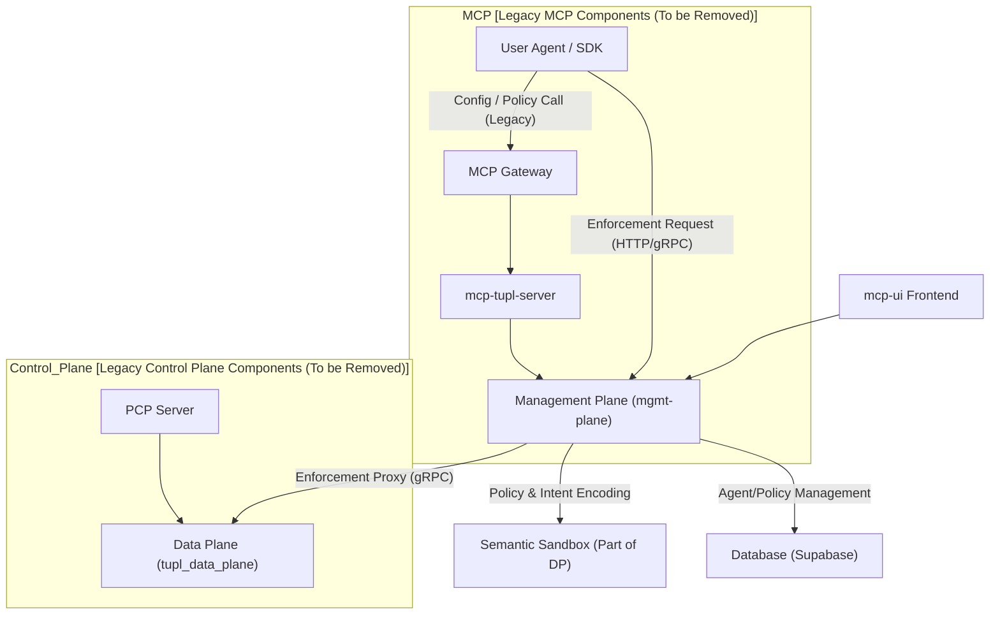
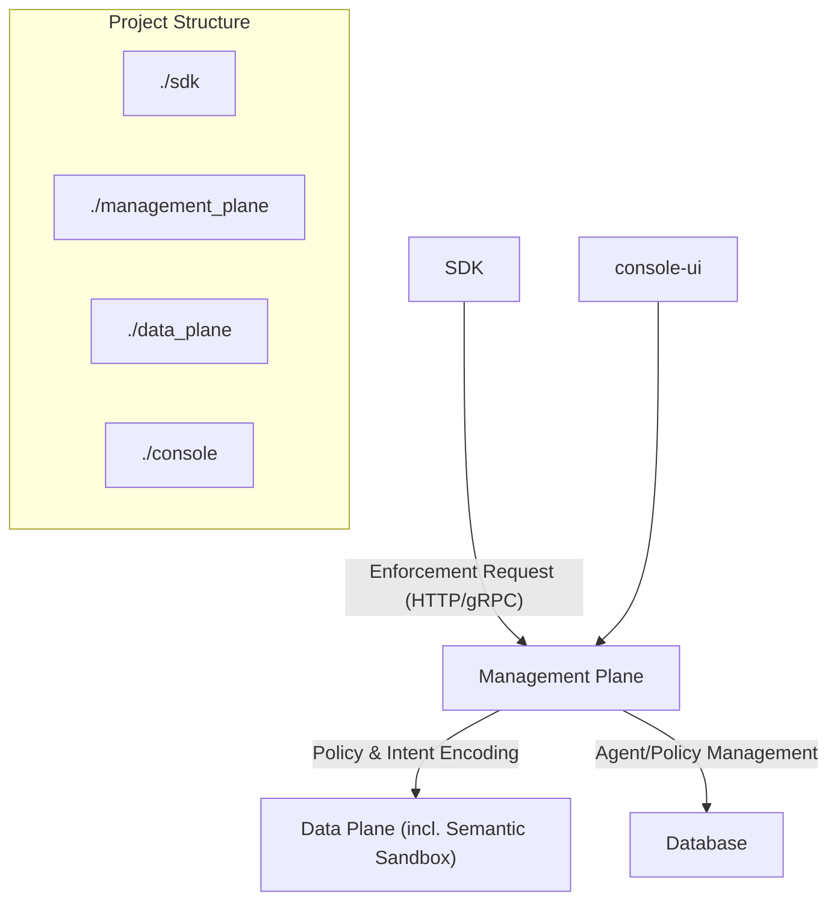

# Cleanup Plan: Architecture Consolidation and Cleanup

## 1. Objective and Scope

The goal of this cleanup is to:
1. Remove all legacy Model Context Protocol (MCP) related components.
2. Remove the unused Policy Control Plane (PCP) and other superfluous modules/directories.
3. Streamline the architecture, ensuring the SDK and UI interact directly with the Management Plane.
4. Restructure the project deployment into a single, cohesive directory.
5. Restructure the project directory to use clear, simplified names (`tupl_sdk` -> `sdk`, `management-plane` -> `management_plane`, `mcp-ui` -> `console`).
6. Remove the `tupl_data_plane` git submodule dependency.
7. Remove the unused frontend project (`ui`).

The scope covers:
1. Removal of redundant projects: `mcp-gateway/`, `mcp-tupl-server/`, `policy_control_plane/`, and `ui/`.
2. Consolidating the policy configuration flow within the `management_plane`.
3. Renaming core directories: `tupl_sdk` -> `sdk`, `management-plane` -> `management_plane`, `mcp-ui` -> `console`, `tupl_data_plane` -> `data_plane`.
4. Removing `tupl_data_plane` as a git submodule.
5. Consolidating the entire `deployment/` folder structure to remove redundancy.
6. Code refactoring across all affected modules.

## 2. Current Architecture Overview (Before Cleanup)

The current system relies on three planes and various auxiliary services. The MCP was an intermediary layer for complex policy configuration and integration which is now deprecated.

## 3. Target Architecture Overview (After Cleanup)

The simplified architecture removes the entire MCP toolchain, focusing on the core components and leveraging the consolidated frontend.

## 4. Detailed Implementation Steps (TODO List)

This plan assumes a clean state where the `ui` directory is unused and `mcp-ui` is kept and renamed. The execution will happen in the `code` mode.

### Phase 1: Removal of Redundant Components & Git Cleanup

Task Description | Status | Rationale |
|---|---|---|
1.1 | Ensure all contents of the `tupl_data_plane` directory are fully materialized (not just git links). | [ ] | Prepare the data plane content for direct use. |
1.2 | Execute `git submodule deinit -f tupl_data_plane` and `rm -rf .git/modules/tupl_data_plane/`. | [ ] | Remove the unwanted submodule dependency. |
1.3 | Remove `.gitmodules` file (if present). | [ ] | Clean up git configuration. |
1.4 | Execute `rm -rf mcp-gateway/ mcp-tupl-server/ policy_control_plane/ ui/`. | [ ] | Remove all unused/deprecated directories. |
1.5 | Remove `tupl_sdk/python/tupl/mcp_client.py` file and update `tupl_sdk/python/tupl/__init__.py` to remove `mcp_client` imports and logic. | [ ] | Remove the MCP integration from the SDK. |
1.6 | Update `management-plane/app/config.py` to remove the comment referencing `Guard Console (mcp-ui)`. | [ ] | Cleanup configuration file. |

### Phase 2: Project Restructuring (Renaming)

Task Description | Status | Rationale |
|---|---|---|
2.1 | Rename `tupl_sdk` directory to `sdk`. | [ ] | Standardize module names. |
2.2 | Rename `management-plane` directory to `management_plane`. | [ ] | Standardize module names. |
2.3 | Rename `tupl_data_plane` directory to `data_plane`. | [ ] | Standardize module names. |
2.4 | Rename `mcp-ui` directory to `console`. | [ ] | Standardize module names. |
2.5 | Rename `deployment/ui/` directory to `deployment/console/`. | [ ] | Align deployment structure. |

### Phase 3: Deployment Consolidation & Cleanup

Task Description | Status | Rationale |
|---|---|---|
3.1 | Consolidate deployment structure by moving essential files from `deployment/gateway/`, `deployment/security-stack/`, and `deployment/console/` to the root `deployment/` directory. | [ ] | Simplify deployment path as requested. |
3.2 | Rename and move: `deployment/security-stack/Dockerfile` -> `deployment/Dockerfile.security`. | [ ] | Component-specific Dockerfile. |
3.3 | Rename and move: `deployment/ui/Dockerfile` -> `deployment/Dockerfile.console`. | [ ] | Component-specific Dockerfile. |
3.4 | Move: `deployment/security-stack/supervisord.conf` -> `deployment/supervisord.conf`. | [ ] | Centralize configuration. |
3.5 | Move: `deployment/ui/nginx.conf` -> `deployment/nginx.console.conf`. | [ ] | Centralize configuration. |
3.6 | Move: `deployment/gateway/docker-compose.production.yml` -> `deployment/docker-compose.production.yml`. | [ ] | Centralize core files. |
3.7 | Move: `deployment/gateway/docker-compose.local.yml` -> `deployment/docker-compose.local.yml`. | [ ] | Centralize core files. |
3.8 | Update `deployment/docker-compose.production.yml` and `deployment/docker-compose.local.yml` to: a) reference new `deployment/` structure, b) remove `mcp-gateway-http` service, c) remove `8001` port and Control Plane URL, d) rename `mcp-ui` service to `console-ui`, and e) update build paths. | [ ] | Major restructuring and removal cleanup. |
3.9 | Update `deployment/Dockerfile.security` to reference new source directories (`management_plane`, `data_plane`, `sdk`). | [ ] | Update Docker build context after renaming. |
3.10 | Update `deployment/Dockerfile.console` to reference new source directory (`console`). | [ ] | Update Docker build context after renaming. |
3.11 | Update `deployment/deploy-production.sh` and `deployment/deploy-local.sh` scripts to reflect the new file paths, service names, and URL references (remove MCP and Control Plane references, update submodule logic removal). | [ ] | Ensure non-ambiguous deployment process. |
3.12 | Delete all remaining, now empty/redundant directories in `deployment/`: `deployment/gateway/`, `deployment/security-stack/`, and `deployment/ui/`. | [ ] | Complete deployment consolidation. |

### Phase 4: Final Code Cleanup and Validation

Task Description | Status | Rationale |
|---|---|---|
4.1 | Perform global search and replace for old module names in remaining files (e.g., in Python imports, shell scripts, and documentation like `AGENTS.md`). | [ ] | Final synchronization of names. |
4.2 | Update `console/` codebase to remove pages and logic related to "McpServersPage" (e.g., `src/lib/mock-data/mcp-servers.ts` and `src/pages/McpServersPage.tsx`). | [ ] | Remove explicitly MCP-related frontend features. |
4.3 | Perform a project-wide search for remaining references to "mcp", "tupl_sdk", "management-plane", "tupl_data_plane", and "policy_control_plane". | [ ] | Final validation. |

## 5. Next Steps

Upon user approval of this plan, the agent will switch to the `code` mode to begin execution, starting with Phase 1.